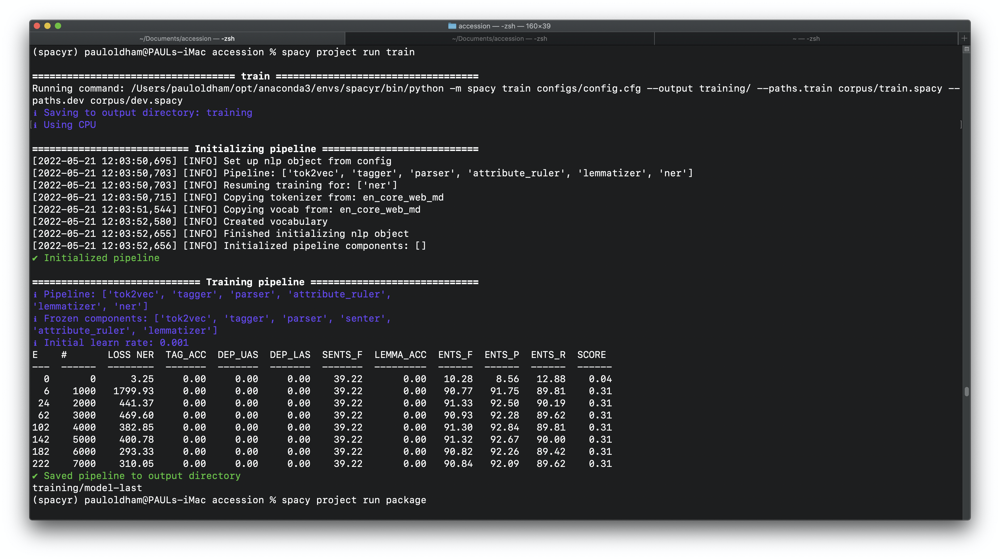
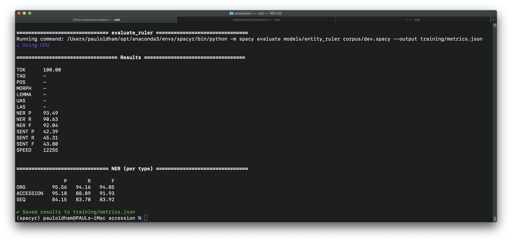

<!-- README.md is generated from README.Rmd. Please edit that file -->

```{r, include = FALSE}
knitr::opts_chunk$set(
  collapse = TRUE,
  comment = "#>"
)
```


## Introduction

The general aim is to create a machine learning model that will identify and extract accession numbers relating to biological entities, notably DNA, protein sequences and samples from patent texts. The main focus is on identifying and extracting accession numbers from the International Nucleotide Sequence Database Collaboration (INSDC) consisting of the European Nucleotide Archive (ENA), the National Center for Biotechnology Information (NCBI) and the DNA Database of Japan (DDBJ). This involves capturing a range of organisation names associated with accession numbers in texts as well as patterns for accession numbers that are typically numeric (138973) or alphanumeric (NM138973) in form.

A secondary aim is to explore whether it is possible to link accession numbers referenced in the description section of patent texts (the main body of a patent application) with references to sequences appearing in the patent claims. Typically, patent applicants make reference to sequences using the accession number and the expression `SEQ ID NO: x` in the description. However, in the claims section of an application only the SEQ ID will appear. This makes it difficult to interpret exactly what sequence is involved in the patent claims and the role of a sequence in the claims (e.g. as reference material or as material to or part of the claimed invention). It is therefore desirable to explore whether the connection between the sequence identifiers in the claims and accession numbers can be established in an automated way. 

Natural Language Processing involves extracting named entities such as persons, organisations, geographic place names etc. from texts. Over the last ten years traditional text mining techniques have increasingly been replaced or combined with machine learning models, notably deep learning models based on convolutional neural networks (CNNs) using word vectors (e.g. word2vec) for use on CPU and the state of the art BERT transformer models (Bidirectional Encoder Representations from Transformers) models designed for use on GPU. A popular machine learning library for NLP in production is the spaCy python library that allows for the use of either vector or transformer models. In contrast with other popular models such as NLTK or scikit-learn, spaCy is directed to use in production where project templates can be used to train a model and make it immediately available for use in production as a python (pip) installable package. While the state of the art in named entity recognition is represented by transformer models on GPU, for the present task we preferred to use the more readily accessible CPU based spaCy medium English model with word vectors as the basis for the accession recognition tasks identified above. This means that the output model can be readily used in production and installed by users as a standard python package on a laptop.

## Step 1: Generate Annotations and Train a Starter Model

NLP models are typically pre-trained on a large corpus of texts and are able to make predictions about entity types for a set of standard labels 'out of the box' (e.g. DATE, CARDINAL, QUANTITY, PERSON, ORG, GPE for geo political entities such as countries, LOC for locations such as mountain ranges etc). However, it is normally necessary to improve the predictions made by a pre-trained model for texts from a specific domain (e.g. scientific or patent texts) and to add additional labels. In the context of the present research we will focus on improving capture for the pre-trained ORG label for organisations and add the ACCESSION and SEQ labels. 

Improvements and additions to the labels in pre-trained models require the availability of annotated texts in the domain of interest that contain the desired labels (ORG, ACCESSION, SEQ). A machine learning model is trained using the annotated texts with a portion of the annotated texts for training (typically 70%) and a portion for evaluation or testing of model performance (typically 70%). The evaluation or test set is not seen by the model during training. This allows for the trained model to be evaluated against a set of data where the answer is already known. Evaluation involves the use of a range of statistics notably the calculation of the loss rate, recall and precision with the harmonic mean between precision and recall constituting the F-score used to assess the balance of performance across precision and recall.  

The most important challenge in NLP tasks is generating sufficient annotations in the domain to train a model to perform to a useful standard (e.g. 80% of target entities or above depending on the task). In the present research we used a table of short texts in patents containing references in USPTO granted patents (48.6 million rows) that is made available through the USPTO PatentsView data service. Annotations were manually created and adjusted using the Prodigy annotation tool from the makers of spaCy (explosion.ai). This allows for tight integration between the creation of annotations and training models. 

Annotation and training is an iterative process involving multiple steps that is directed towards creating a good general model for the specific task. That is, a model that performs well in precision and recall of the desired entities against previously unseen texts in the domain of interest. It is important to emphasise that the aim is not to create a model that performs perfectly on the training data as this will result in over-fitting (a model that is perfect on training data but performs poorly on unseen data). 

Producing annotations for new labels involves overcoming the `cold start` problem (a lack of sufficient data for a label to train a model). To overcome this problem we searched the USPTO references table for all mentions of the word accession, or the organisation names and their full name variants and acronyms (EMBL, EBI, ENA, NCBI, DDBJ etc) to produce a raw set of 841,728 example texts from 14,167 granted US patents (see `assets/accession_refs_id.csv`). In addition, using a separate dataset of worldwide patent data that is known to contain sequences from the Lens patent database we identified a set of 348,076 texts containing the same search terms (assets/accession_sent_nchar2000.csv) from xxx documents [note: could usefully exclude shared docs or exact match texts]. The aim of these datasets is to use samples of the texts for annotation and testing of models. 

An important strength of spaCy and the Prodigy annotation tool is that it is possible to combine a machine learning model with a dictionary or thesaurus of labelled terms (such as ORG for ENA or European Nucleotide Authority). In the language of spaCy this is called an 'entity_ruler' and is written in JSON Lines (jsonl) format where each line is a valid JSON object. 

>{"label":"ORG","pattern":[{"lower":"ncbi"}], "id": "ncbi"}
{"label":"ORG","pattern":[{"lower":"national"},{"lower":"center"},{"lower":"for"},{"lower":"biotechnology"},{"lower":"information"}], "id": "ncbi"}

In spaCy and Prodigy it is possible to write patterns that either explicitly capture a term as is (known as ORTH) or as in the example below to use `lower` to capture both uppercase and lower case versions of a string. In addition, it is also possible to use regular expressions and this proved particularly important for capturing accession numbers. We used regular expressions developed by the European Nucleotide Authority^[https://ena-docs.readthedocs.io/en/latest/submit/general-guide/accessions.html] with additions to reflect the use of white space in identifiers in patent texts. 

>{"label": "ACCESSION", "pattern": [{"text":{"REGEX": "PRJ(E|D|N)[A-Z][0-9]+"}}]}
{"label": "ACCESSION", "pattern": [{"text":{"REGEX": "(E|D|S)RP[0-9]{6,}"}}]}
{"label": "ACCESSION", "pattern": [{"text":{"REGEX": "SAM(E|D|N)[A-Z]?[0-9]+"}}]}

In Step 1 a set of 957 annotations were developed in Prodigy using the English medium model and the patterns set to pre-highlight matches. These annotations were exported from Prodigy into spaCy format as a corpus of train (70%) and eval (30%).

```{bash, prodigy, eval=FALSE}

# transfer the annotations to spaCy format splitting into train and eval 
prodigy data-to-spaCy corpus --ner accession_usptorefs,accession_sent_nchar2000rerun --eval-split 0.3 

# set up the corpus in the project (writes to train and dev for eval)
python -m spaCy train corpus/config.cfg --paths.train corpus/train.spaCy --paths.dev corpus/dev.spaCy

```

<!---# (spaCyr) pauloldham@PAULs-iMac accession % python -m spaCy train corpus/config.cfg --paths.train corpus/train.spaCy --paths.dev corpus/dev.spaCy--->

For the training a spaCy project was created from an existing template containing commands for training, adding an entity ruler and packaging a model as a pip installable.

```{bash, train, eval=FALSE}
spaCy project run train
```

The performance of the model over ten iterations is displayed in Figure \@ref(fig:step1) below. The scores of interest are recall ENTS_R and precision ENTS_P and the F score (ENTS_F) consisting of the harmonic mean between precision and recall to evaluate the overall performance of the model. 

```{r step1, echo=FALSE, fig.align='center', fig.cap="Evaluating a starter model"}

```
The F score score of 90.84 suggest that we have a good model. However, note that the training and evaluation sets are relatively small compared with the scale of real world data. Nevertheless, This illustrates that NLP models can be trained with a relatively small number of examples as a starter set and produce meaningful results. 

Evaluation of the performance of the starter model was carried out by processing the full 817,000 texts and inspecting the results for valid and noisy results. In the table below we display the totals for the organisation label and the accession label.

The Organisation (ORG) label

```{r org1, message=FALSE, fig.cap="Assessing The ORG Label"}
library(tidyverse)
accession_ref_all_id_results <- read_csv("results/accession_ref_all_id_results.csv") 

accession_ref_all_id_results %>% 
  filter(entity_label == "ORG") %>% 
  count(entity_id, entity_text, sort = TRUE) %>% 
  head(., 20) %>% 
  knitr::kable()
```

In the case of organisation label we can observe that there are multiple forms of the database name GenBank that we class as an organisation and assign to the entity id ncbi in the entity_ruler to allow for aggregation. We also observe that the ORG label is capturing names such as 'Journal of Biological Chemistry` that are not organisations. This and other examples demonstrate the challenge for a model in discriminating types of entities that are typically composed of noun phrases. 

Our second label for ACCESSION identifiers also reveals issues involving noise.

```{r, acc1}
accession_ref_all_id_results %>% 
  filter(entity_label == "ACCESSION") %>% 
  count(entity_id, entity_text, sort = TRUE) %>% 
  head(., 30) %>% 
  knitr::kable()
```

In this case we have a mix of organisation names, accession like names, a url and an accession number. 

As this exposes, it is one thing to achieve good scores when training a model on a small set of annotations, and another for that model to perform in the same way on real world unseen data. Nevertheless, while the noise level was high, there were also many thousands of valid hits that were generated by this approach as suggested in the table below.

```{r, valid}
accession_ref_all_id_results %>% 
  head(20) %>% 
  knitr::kable()
```

##  Step 2: Correcting annotations

In the second step we focused on correcting the annotations, adding the SEQ label and adjusting and improving the entity ruler. This is performed using the ner.correct recipe in Prodigy using the model built in step 1 with the entity ruler added.

The SEQ label was added at this stage because Step 1 annotations revealed that accession numbers are commonly located in close proximity to SEQ ID numbers (that is, in the same sentence or paragraph). 

```{bash, step2, eval=FALSE}
# note that  names of the sets got mixed up here and requires correction
prodigy ner.correct accession_refs_correct en_accession_ruler ./accession_sent_nchar2000.csv  --label ORG,ACCESSION,SEQ -U

prodigy ner.correct accession_nchar_correct en_accession_ruler ./accession_refs.csv  --label ORG,ACCESSION,SEQ -U
```


The corrected annotation sets are then exported to spaCy format as the new corpus with the 70% and 30% split. 

```{bash, exportcorr, eval=FALSE}
accession % prodigy data-to-spaCy corpus --ner accession_refs_correct,accession_nchar_correct --eval-split 0.3 
```

In the next step a new model is trained and packaged with the adjusted entity_ruler. Note here that a total of 1436 annotations were made. spaCy automatically compacted these to 1356 with Training: 953 | Evaluation: 403. We can now also produce some more detailed evaluation measures on the performance of the model for each label. 

```{r, evalruler, echo=FALSE}

```

We can see in the results that overall the model has an F-Score of 92.04 against the 403 unseen records in the test set. We can also see the per label scores under NER. The top performing label is ORG followed by ACCESSION and SEQ. 

Note that the recall for the ACCESSION label is lower than we would like as the main target of this exercise and the SEQ label is lagging behind the other two. 

These results are to be expected for three reasons. First, the pre-trained model already includes the ORG label. We should therefore expect improvements to the ORG label scores. In contrast the Accession label is new and the lower recall scores perhaps reflect some of the difficulties involved in distinguishing one set of alpha numeric or pure numeric strings from others. 

The difficulties experienced by the SEQ label probably reflect the variations from the `SEQ ID NO: 1` pattern to `SEQ ID NO: 1, 2, 3, 4 or 5` and expose a limitation of token based models in cases where an entity may span multiple tokens. That is, where an entity is captured in one or two tokens a model will perform well. Where a entity spans multiple tokens with significant variations in the number of tokens then a model will struggle. This is a recognised issue and spaCy now includes a span categorizer to assist with addressing entities with varying span lengths. 

<!--- Could use train curve here from prodigy to see if more will do better?

Moving beyond examination of the scores we can once again test the data against our wider set. --->

This code runs a function in R `get_entities()` by calling a python script in `inst/label_script.py` that writes the results to a csv file. Note that you must have a python environment containing the model attached to your RStudio environment (Set in Project Options or GLobal Options to set the path).

```{r, large, eval=FALSE, echo=TRUE}
large <- get_entities(path = "assets/accession_ref_all_id.csv", model = "en_accession_ruler", dest = "results/accession_ref_all_id_results.csv")
```

Read the dataset back in and count up the results for the labels.

```{r setupcounts, eval=FALSE, echo=FALSE, , message=FALSE}
large <- read_csv("results/accession_ref_all_id_results.csv")

large_count <- large %>% 
  count(entity_label)

write_csv(large_count, "data/large_count.csv")

large_org <- large %>% 
  filter(entity_label == "ORG") %>% 
  count(entity_text, sort = TRUE)

write_csv(large_org, "data/large_org.csv")


large_accession <- large %>% 
  filter(entity_label == "ACCESSION") %>% 
  count(entity_text, sort = TRUE)

write_csv(large_accession, "data/large_accesion.csv")


large_seq <- large %>% 
  filter(entity_label == "SEQ") %>% 
  count(entity_text, sort = TRUE)

write_csv(large_seq, "data/large_seq.csv")

```


```{r, largecount, cache=FALSE, message=FALSE}
#large <- read_csv("results/accession_ref_all_id_results.csv")

read_csv("data/large_count.csv") %>% 
  knitr::kable()
```

Inspect the ORG label.

```{r, largeorg, cache=FALSE, message=FALSE}
read_csv("data/large_org.csv") %>% 
  head(., 30) %>% 
  knitr::kable()
```

Inspect the ACCESSION label.

```{r, largeaccession, message=FALSE}
read_csv("data/large_accesion.csv") %>% 
  head(., 30) %>% 
  knitr::kable()
```

Inspect the SEQ label.

```{r largeseq}
read_csv("data/large_accesion.csv") %>% 
  head(., 30) %>% 
  knitr::kable()
```


## Step 3: Identify Noise, Make Corrections and Repackage

TBD
