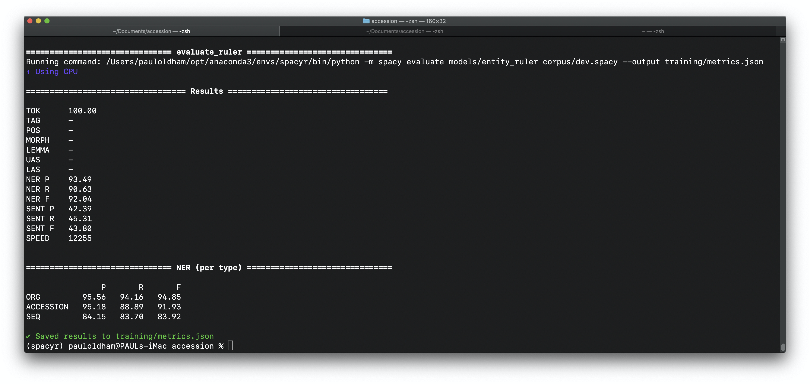

<!-- README.md is generated from README.Rmd. Please edit that file -->

## Introduction

The general aim is to create a machine learning model that will identify
and extract accession numbers relating to biological entities, notably
DNA, protein sequences and samples from patent texts. The main focus is
on identifying and extracting accession numbers from the International
Nucleotide Sequence Database Collaboration (INSDC) consisting of the
European Nucleotide Archive (ENA), the National Center for Biotechnology
Information (NCBI) and the DNA Database of Japan (DDBJ). This involves
capturing a range of organisation names associated with accession
numbers in texts as well as patterns for accession numbers that are
typically numeric (138973) or alphanumeric (NM138973) in form.

A secondary aim is to explore whether it is possible to link accession
numbers referenced in the description section of patent texts (the main
body of a patent application) with references to sequences appearing in
the patent claims. Typically, patent applicants make reference to
sequences using the accession number and the expression `SEQ ID NO: x`
in the description. However, in the claims section of an application
only the SEQ ID will appear. This makes it difficult to interpret
exactly what sequence is involved in the patent claims and the role of a
sequence in the claims (e.g. as reference material or as material to or
part of the claimed invention). It is therefore desirable to explore
whether the connection between the sequence identifiers in the claims
and accession numbers can be established in an automated way.

Natural Language Processing involves extracting named entities such as
persons, organisations, geographic place names etc. from texts. Over the
last ten years traditional text mining techniques have increasingly been
replaced or combined with machine learning models, notably deep learning
models based on convolutional neural networks (CNNs) using word vectors
(e.g. word2vec) for use on CPU and the state of the art BERT transformer
models (Bidirectional Encoder Representations from Transformers) models
designed for use on GPU. A popular machine learning library for NLP in
production is the spaCy python library that allows for the use of either
vector or transformer models. In contrast with other popular models such
as NLTK or scikit-learn, spaCy is directed to use in production where
project templates can be used to train a model and make it immediately
available for use in production as a python (pip) installable package.
While the state of the art in named entity recognition is represented by
transformer models on GPU, for the present task we preferred to use the
more readily accessible CPU based spaCy medium English model with word
vectors as the basis for the accession recognition tasks identified
above. This means that the output model can be readily used in
production and installed by users as a standard python package on a
laptop.

## Step 1: Generate Annotations and Train a Starter Model

NLP models are typically pre-trained on a large corpus of texts and are
able to make predictions about entity types for a set of standard labels
‘out of the box’ (e.g. DATE, CARDINAL, QUANTITY, PERSON, ORG, GPE for
geo political entities such as countries, LOC for locations such as
mountain ranges etc). However, it is normally necessary to improve the
predictions made by a pre-trained model for texts from a specific domain
(e.g. scientific or patent texts) and to add additional labels. In the
context of the present research we will focus on improving capture for
the pre-trained ORG label for organisations and add the ACCESSION and
SEQ labels.

Improvements and additions to the labels in pre-trained models require
the availability of annotated texts in the domain of interest that
contain the desired labels (ORG, ACCESSION, SEQ). A machine learning
model is trained using the annotated texts with a portion of the
annotated texts for training (typically 70%) and a portion for
evaluation or testing of model performance (typically 70%). The
evaluation or test set is not seen by the model during training. This
allows for the trained model to be evaluated against a set of data where
the answer is already known. Evaluation involves the use of a range of
statistics notably the calculation of the loss rate, recall and
precision with the harmonic mean between precision and recall
constituting the F-score used to assess the balance of performance
across precision and recall.

The most important challenge in NLP tasks is generating sufficient
annotations in the domain to train a model to perform to a useful
standard (e.g. 80% of target entities or above depending on the task).
In the present research we used a table of short texts in patents
containing references in USPTO granted patents (48.6 million rows) that
is made available through the USPTO PatentsView data service.
Annotations were manually created and adjusted using the Prodigy
annotation tool from the makers of spaCy (explosion.ai). This allows for
tight integration between the creation of annotations and training
models.

Annotation and training is an iterative process involving multiple steps
that is directed towards creating a good general model for the specific
task. That is, a model that performs well in precision and recall of the
desired entities against previously unseen texts in the domain of
interest. It is important to emphasise that the aim is not to create a
model that performs perfectly on the training data as this will result
in over-fitting (a model that is perfect on training data but performs
poorly on unseen data).

Producing annotations for new labels involves overcoming the
`cold start` problem (a lack of sufficient data for a label to train a
model). To overcome this problem we searched the USPTO references table
for all mentions of the word accession, or the organisation names and
their full name variants and acronyms (EMBL, EBI, ENA, NCBI, DDBJ etc)
to produce a raw set of 841,728 example texts from 14,167 granted US
patents (see `assets/data/accession_ref_all_id.csv`). In addition, using
a separate dataset of worldwide patent data that is known to contain
sequences from the Lens patent database we identified a set of 348,076
texts containing the same search terms
(assets/data/accession_sent_nchar2000.csv) from xxx documents \[note:
could usefully exclude shared docs or exact match texts\]. The aim of
these datasets is to use samples of the texts for annotation and testing
of models.

An important strength of spaCy and the Prodigy annotation tool is that
it is possible to combine a machine learning model with a dictionary or
thesaurus of labelled terms (such as ORG for ENA or European Nucleotide
Authority). In the language of spaCy this is called an ‘entity_ruler’
and is written in JSON Lines (jsonl) format where each line is a valid
JSON object.

> {“label”:“ORG”,“pattern”:\[{“lower”:“ncbi”}\], “id”: “ncbi”}
> {“label”:“ORG”,“pattern”:\[{“lower”:“national”},{“lower”:“center”},{“lower”:“for”},{“lower”:“biotechnology”},{“lower”:“information”}\],
> “id”: “ncbi”}

In spaCy and Prodigy it is possible to write patterns that either
explicitly capture a term as is (known as ORTH) or as in the example
below to use `lower` to capture both uppercase and lower case versions
of a string. In addition, it is also possible to use regular expressions
and this proved particularly important for capturing accession numbers.
We used regular expressions developed by the European Nucleotide
Authority[^1] with additions to reflect the use of white space in
identifiers in patent texts.

> {“label”: “ACCESSION”, “pattern”: \[{“text”:{“REGEX”:
> “PRJ(E\|D\|N)\[A-Z\]\[0-9\]+”}}\]} {“label”: “ACCESSION”, “pattern”:
> \[{“text”:{“REGEX”: “(E\|D\|S)RP\[0-9\]{6,}”}}\]} {“label”:
> “ACCESSION”, “pattern”: \[{“text”:{“REGEX”:
> “SAM(E\|D\|N)\[A-Z\]?\[0-9\]+”}}\]}

## The Starter Model

In Step 1 a set of 957 annotations were developed in Prodigy using the
English medium model and the patterns set to pre-highlight matches.
These annotations were exported from Prodigy into spaCy format as a
corpus of train (70%) and eval (30%).

``` bash

# transfer the annotations to spaCy format splitting into train and eval 
prodigy data-to-spaCy corpus --ner accession_usptorefs,accession_sent_nchar2000rerun --eval-split 0.3 

# set up the corpus in the project (writes to train and dev for eval)
python -m spacy train corpus/config.cfg --paths.train corpus/train.spaCy --paths.dev corpus/dev.spaCy
```

<!---# (spaCyr) pauloldham@PAULs-iMac accession % python -m spaCy train corpus/config.cfg --paths.train corpus/train.spaCy --paths.dev corpus/dev.spaCy--->

For the training a spaCy project was created from an existing template
containing commands for training, adding an entity ruler (thesaurus or
dictionary of terms to match) and packaging a model as a pip
installable.

``` bash
spacy project run train
```

The performance of the model over ten iterations is displayed in Figure
@ref(fig:step1) below. The scores of interest are recall `ENTS_R` and
precision `ENTS_P` and the F score (`ENTS_F`) consisting of the harmonic
mean between precision and recall to evaluate the overall performance of
the model.


The F score score of 90.84 suggest that we have a good model. However,
note that the training and evaluation sets are relatively small compared
with the scale of real world data. Nevertheless, This illustrates that
NLP models can be trained with a relatively small number of examples as
a starter set and produce meaningful results.

Evaluation of the performance of the starter model was carried out by
processing the full 817,000 texts and inspecting the results for valid
and noisy results. In the table below we display the totals for the
organisation label and the accession label.

The Organisation (ORG) label.

``` r
library(tidyverse)
accession_ref_all_id_results <- read_csv("results/en_entity_ruler0/accession_ref_all_id_results.csv", show_col_types = FALSE) 

accession_ref_all_id_results %>% 
  filter(entity_label == "ORG") %>% 
  count(entity_id, entity_text, sort = TRUE) %>% 
  head(., 20) %>% 
  knitr::kable()
```

| entity_id | entity_text                                   |     n |
|:----------|:----------------------------------------------|------:|
| ncbi      | GenBank                                       | 21376 |
| ncbi      | NCBI                                          | 11496 |
| embl      | EBI                                           |  7545 |
| embl      | EMBL                                          |  5784 |
| ncbi      | Genbank                                       |  5580 |
| ncbi      | National Center for Biotechnology Information |  4905 |
| NA        | American Chemical Society                     |  3417 |
| uniprot   | UniProt                                       |  2692 |
| NA        | Journal of Biological Chemistry               |  2204 |
| NA        | National Institutes of Health                 |  2112 |
| NA        | ACM                                           |  1884 |
| uniprot   | UNIPROT                                       |  1626 |
| NA        | American Physiological Society                |  1050 |
| NA        | American Heart Association                    |   937 |
| atcc      | ATCC                                          |   716 |
| uniprot   | Uniprot                                       |   708 |
| NA        | American Society of Nephrology                |   498 |
| NA        | American Heart Association, Inc.              |   446 |
| NA        | GNPD                                          |   443 |
| NA        | American Institute of Physics                 |   425 |

In the case of organisation label we can observe that there are multiple
forms of the database name GenBank that we class as an organisation and
assign to the entity id ncbi in the entity_ruler to allow for
aggregation. We also observe that the ORG label is capturing names such
as ’Journal of Biological Chemistry\` that are not organisations. This
and other examples demonstrate the challenge for a model in
discriminating types of entities that are typically composed of noun
phrases.

Our second label for ACCESSION identifiers also reveals issues involving
noise.

``` r
accession_ref_all_id_results %>% 
  filter(entity_label == "ACCESSION") %>% 
  count(entity_id, entity_text, sort = TRUE) %>% 
  head(., 30) %>% 
  knitr::kable()
```

| entity_id | entity_text                                 |   n |
|:----------|:--------------------------------------------|----:|
| NA        | PCT                                         | 497 |
| NA        | 03C 3137                                    | 393 |
| NA        | AB 2011                                     | 349 |
| NA        | 4                                           | 250 |
| NA        | LG Optimus                                  | 249 |
| NA        | Angewandte                                  | 239 |
| NA        | BACE1                                       | 169 |
| NA        | ACM                                         | 163 |
| NA        | www.clinicaltrials.gov/ct2/show/NCT01390831 | 154 |
| NA        | Angove                                      | 153 |
| NA        | R1524                                       | 153 |
| NA        | Dermatol                                    | 151 |
| NA        | Medtronic                                   | 131 |
| NA        | R1517                                       | 129 |
| NA        | P15647                                      | 124 |
| NA        | J05199                                      | 122 |
| NA        | 100300                                      | 117 |
| NA        | R1599                                       | 115 |
| NA        | EMC Corporation                             | 113 |
| NA        | 4th                                         | 108 |
| NA        | ASME                                        | 108 |
| NA        | LG KE850                                    | 108 |
| NA        | 5th                                         | 107 |
| NA        | 11β                                         | 100 |
| NA        | 11669                                       |  99 |
| NA        | 7356                                        |  98 |
| NA        | 8220;Semiconductor Chip Assembly            |  98 |
| NA        | Samsung F700                                |  98 |
| NA        | AAB10482                                    |  94 |
| NA        | F1209                                       |  92 |

In this case we have a mix of organisation names, accession like names,
a url and an accession number.

As this exposes, it is one thing to achieve good scores when training a
model on a small set of annotations, and another for that model to
perform in the same way on real world unseen data. Nevertheless, while
the noise level was high, there were also many thousands of valid hits
that were generated by this approach as suggested in the table below.

``` r
accession_ref_all_id_results %>% 
  head(20) %>% 
  knitr::kable()
```

| patent_id | id      | entity_id | entity_text            | entity_label | entity_start | entity_end | entity_id_no | country_code |
|:----------|:--------|:----------|:-----------------------|:-------------|-------------:|-----------:|-------------:|:-------------|
| USD581385 | D581385 | NA        | Bird                   | ORG          |            0 |          4 | 0.000000e+00 | US           |
| US7491532 | 7491532 | ncbi      | NCBI                   | ORG          |            0 |          4 | 4.160624e+18 | US           |
| US7491532 | 7491532 | NA        | X02996                 | ACCESSION    |           37 |         43 | 0.000000e+00 | US           |
| US7491532 | 7491532 | NA        | J01967                 | ACCESSION    |           44 |         50 | 0.000000e+00 | US           |
| US7491532 | 7491532 | NA        | J01968                 | ACCESSION    |           51 |         57 | 0.000000e+00 | US           |
| US7491532 | 7491532 | NA        | J01970                 | ACCESSION    |           58 |         64 | 0.000000e+00 | US           |
| US7491532 | 7491532 | NA        | J01971                 | ACCESSION    |           65 |         71 | 0.000000e+00 | US           |
| US7491532 | 7491532 | NA        | J01972                 | ACCESSION    |           72 |         78 | 0.000000e+00 | US           |
| US7491532 | 7491532 | NA        | J01974                 | ACCESSION    |           79 |         85 | 0.000000e+00 | US           |
| US7491532 | 7491532 | NA        | J01976                 | ACCESSION    |           86 |         92 | 0.000000e+00 | US           |
| US7491532 | 7491532 | NA        | J01977                 | ACCESSION    |           93 |         99 | 0.000000e+00 | US           |
| US7491532 | 7491532 | NA        | J01978                 | ACCESSION    |          100 |        106 | 0.000000e+00 | US           |
| US7491532 | 7491532 | NA        | J01979                 | ACCESSION    |          107 |        113 | 0.000000e+00 | US           |
| US7491532 | 7491532 | NA        | K00515                 | ACCESSION    |          114 |        120 | 0.000000e+00 | US           |
| US7491532 | 7491532 | NA        | V00025                 | ACCESSION    |          121 |        127 | 0.000000e+00 | US           |
| US7491532 | 7491532 | NA        | V00026                 | ACCESSION    |          128 |        134 | 0.000000e+00 | US           |
| US7491532 | 7491532 | NA        | V00027                 | ACCESSION    |          135 |        141 | 0.000000e+00 | US           |
| US7491532 | 7491532 | NA        | V00029                 | ACCESSION    |          142 |        148 | 0.000000e+00 | US           |
| US8672839 | 8672839 | NA        | Surgical Port Assembly | ORG          |           55 |         77 | 0.000000e+00 | US           |
| US8048420 | 8048420 | embl      | EBI                    | ORG          |           99 |        102 | 1.722845e+18 | US           |

## Step 2: Correcting annotations

In the second step we focused on correcting the annotations, adding the
SEQ label and adjusting and improving the entity ruler. This is
performed using the ner.correct recipe in Prodigy using the model built
in step 1 with the entity ruler added.

The SEQ label was added at this stage because Step 1 annotations
revealed that accession numbers are commonly located in close proximity
to SEQ ID numbers (that is, in the same sentence or paragraph).

<!---# note that  names of the sets got switched here and requires correction. For set 2 the data was reannotated with the correct names and so not a critical issue--->

``` bash

prodigy ner.correct accession_refs_correct en_accession_ruler ./assets/data/accession_sent_nchar2000.csv  --label ORG,ACCESSION,SEQ -U

prodigy ner.correct accession_nchar_correct en_accession_ruler ./assets/data/accession_refs.csv  --label ORG,ACCESSION,SEQ -U
```

The corrected annotation sets are then exported to spaCy format as the
new corpus with the 70% and 30% split.

``` bash
accession % prodigy data-to-spaCy corpus --ner accession_refs_correct,accession_nchar_correct --eval-split 0.3 
```

In the next step a new model is trained and packaged with the adjusted
entity_ruler. Note here that a total of 1436 annotations were made.
spaCy automatically compacted these to 1356 with Training: 953 \|
Evaluation: 403. We can now also produce some more detailed evaluation
measures on the performance of the model for each label.

<!-- -->

We can see in the results that overall the model has an F-Score of 92.04
against the 403 unseen records in the test set. We can also see the per
label scores under NER. The top performing label is ORG followed by
ACCESSION and SEQ.

Note that the recall for the ACCESSION label is lower than we would like
as the main target of this exercise and the SEQ label is lagging behind
the other two.

These results are to be expected for three reasons. First, the
pre-trained model already includes the ORG label. We should therefore
expect improvements to the ORG label scores. In contrast the Accession
label is new and the lower recall scores perhaps reflect some of the
difficulties involved in distinguishing one set of alpha numeric or pure
numeric strings from others.

The difficulties experienced by the SEQ label probably reflect the
variations from the `SEQ ID NO: 1` pattern to
`SEQ ID NO: 1, 2, 3, 4 or 5` and expose a limitation of token based
models in cases where an entity may span multiple tokens. That is, where
an entity is captured in one or two tokens a model will perform well.
Where a entity spans multiple tokens with significant variations in the
number of tokens then a model will struggle. This is a recognised issue
and spaCy now includes a span categorizer to assist with addressing
entities with varying span lengths.

<!--- Could use train curve here from prodigy to see if more will do better?

Moving beyond examination of the scores we can once again test the data against our wider set. --->

This code runs a function in R `get_entities()` by calling a python
script in `inst/label_script.py` that writes the results to a csv file.
Note that you must have a python environment containing the model
attached to your RStudio environment (Set the path in Project Options or
Global Options).

``` r
library(reticulate)
#large <- get_entities(path = "assets/accession_ref_all_id.csv", model = "en_accession_ruler", dest = "results/accession_ref_all_id_results.csv")

source("R/get_entities.R")
# 0.0.1 version
large_updated <- get_entities(path = "assets/accession_ref_all_id.csv", model = "en_accession_ruler", dest = "results/accession_all_results_updated.csv")
```

Read the dataset back in and count up the results for the labels.

``` r
#large <- read_csv("results/accession_ref_all_id_results.csv")

read_csv("data/large_count.csv", show_col_types = FALSE) %>% 
  head() %>% 
  knitr::kable()
```

| entity_label |      n |
|:-------------|-------:|
| ACCESSION    |  98540 |
| ORG          | 239425 |
| SEQ          |   3169 |

Inspect the ORG label.

``` r
read_csv("data/large_org.csv", show_col_types = FALSE) %>% 
  head(., 10) %>% 
  knitr::kable()
```

| entity_text                                   |     n |
|:----------------------------------------------|------:|
| GenBank                                       | 21376 |
| NCBI                                          | 11496 |
| EBI                                           |  7545 |
| Chemical Abstracts Service                    |  5907 |
| EMBL                                          |  5784 |
| STN                                           |  5715 |
| Genbank                                       |  5580 |
| National Center for Biotechnology Information |  4905 |
| American Chemical Society                     |  4894 |
| PubChem                                       |  2741 |

Inspect the ACCESSION label.

``` r
read_csv("data/large_accesion.csv", show_col_types = FALSE) %>% 
  head(., 10) %>% 
  knitr::kable()
```

| entity_text        |   n |
|:-------------------|----:|
| 11β                | 196 |
| 01141006003        | 169 |
| P15647             | 124 |
| 100300             | 123 |
| Chemical Abstracts | 123 |
| J05199             | 122 |
| LG KE850 Prada     | 119 |
| 11669              |  99 |
| 30(b)(1            |  98 |
| 7356               |  98 |

Inspect the SEQ label.

``` r
read_csv("data/large_seq.csv", show_col_types = FALSE) %>% 
  head(., 10) %>% 
  knitr::kable()
```

| entity_text              |   n |
|:-------------------------|----:|
| SEQ ID                   | 448 |
| RTC Industries, Inc.     | 279 |
| RTC Industries, Inc . v. | 256 |
| SEQ ID No. 1             |  96 |
| SEQ ID No                |  92 |
| SEQ ID No. 2             |  68 |
| SEQ ID 1                 |  53 |
| Samsung Galaxy Note7     |  46 |
| SEQ ID No. 6             |  46 |
| SEQ ID No. 64            |  42 |

## Step 3: Correct Annotations and Create a New Model

In this step the trained model is used to correct annotations from the
accession_sent_nchar2000.csv set to create a new annotations set
`accession_refs_correct2`. Because correction of annotations is faster
than creating them manually more annotations were created (2020 in
total).

``` bash
prodigy ner.correct accession_sent_correct2 ./training/model-best ./assets/data/accession_sent_nchar2000.csv  --label ORG,ACCESSION,SEQ
```

The same process was repeated for the second dataset (non patent
literature references mentioning accessions). A total of 600 reference
texts were corrected.

Observation: The npl references contain a wider range of accession
numbers from different sources (CA Plus, STN, Derwent etc) and there is
a question about whether this improves or confuses the model.

``` bash
prodigy ner.correct accession_refs_correct2 ./training/model-best ./assets/data/accession_refs.csv  --label ORG,ACCESSION,SEQ
```

The combined annotations are exported from prodigy to spacy as a new
corpus for a new model on a 70 to 30 split between train and evaluation.
Note that it is clear that some of the raw sentences are duplicated
(handled automatically by spacy) and the sets should be adjusted to
unique sentences.

``` bash
prodigy data-to-spacy corpus --ner accession_sent_correct2,accession_refs_correct2 --eval-split 0.3 
```

We now created version 2 of the model and will overwrite the temporary
model created above for the ner.correct (the model-best).

``` bash
spacy project run train
```

The figure below displays the results

<!-- -->

Note that compared with our started model the recall has improved
significantly from 88 to 94% and we now have a fairly even balance
between precision and recall represented in an F score of 94.12 on the
585 evaluation examples.

We now add the entity ruler to model-best

``` bash
spacy project run entity_ruler    
```

Running command: /Users/pauloldham/opt/anaconda3/envs/spacyr/bin/python
scripts/entity_ruler.py \[(‘Genbank’, ‘ORG’), (‘ncbi’, ‘ORG’), (‘ddbj’,
‘ORG’), (‘embl’, ‘ORG’), (‘ebi’, ‘ORG’), (‘ena’, ‘ORG’), (‘SEQ ID NO:
1’, ‘SEQ’)\]

We now evaluate the model with the ruler attached:

``` bash
spacy project run evaluate_ruler
```

<!-- -->

This is looking pretty good on all labels although it is a little
worrtying that the precision and recall scores are lowest for the
accession label that is our main target here.

We now want to package up the model with the ruler as a pip installable.

``` bash
spacy project run ruler  
```

This will create a pip installable packages with 0.0.2 in
`packages/en_accession_ruler-0.0.2/dist/en_accession_ruler-0.0.2.tar.gz`

TO TRY: train_curve to evaluate if adding more training data improves
the model. Another option is to try train with only the sentences
leaving out the refs and see if the refs are improving scores or adding
noise?

Install the package in an environment (attached to RStudio)

``` bash
pip install packages/en_accession_ruler-0.0.2/dist/en_accession_ruler-0.0.2.tar.gz
```

### Extract the Entities

Extract entities from texts. This assumes that the model is installed in
an environment linked to RStudio (Global or Project Options). The folder
`inst/` contains a python script that calls spacy based on the model
name provided. The results get written to `dest = x`

Load the function

``` r
library(reticulate)
get_entities <- function(path = NULL, model = NULL, dest = NULL) {
  source_python("inst/label_script.py")
  entities_df = text_labels(path,model,dest)
}
```

Iterate over the references

``` r
results_refs <- get_entities(path = "assets/data/accession_ref_all_id.csv", 
                             model = "en_accession_ruler", 
                             dest = "results/accession_ref_model02.csv")

write_csv(results_refs, "results/results_regs02.csv")
```

Do the same for the sentences (having renamed sent_id to id)

``` r
results_sent <- get_entities(path = "assets/data/accession_sent.csv", 
                             model = "en_accession_ruler", 
                             dest = "results/accession_sent_results.csv") 

write_csv(results_sent, "results/results_sent02.csv")
```

## Data Summary

### 1. Sentences dataset

Take a look

|  id | entity_id | entity_text                                   | entity_label | entity_start | entity_end | entity_id_no |
|----:|:----------|:----------------------------------------------|:-------------|-------------:|-----------:|-------------:|
| 807 | ncbi      | GenBank                                       | ORG          |          187 |        194 | 4.160624e+18 |
| 807 | NA        | Brookhaven Protein Data Bank                  | ORG          |          264 |        292 | 0.000000e+00 |
| 807 | embl      | EMBL                                          | ORG          |          363 |        367 | 1.722845e+18 |
| 807 | ddbj      | DDBJ                                          | ORG          |          373 |        377 | 1.672235e+19 |
| 808 | ncbi      | National Center for Biotechnology Information | ORG          |          162 |        207 | 4.160624e+18 |
| 808 | ncbi      | NCBI                                          | ORG          |          209 |        213 | 4.160624e+18 |
| 811 | ncbi      | NCBI                                          | ORG          |           50 |         54 | 4.160624e+18 |
| 831 | ncbi      | Genbank                                       | ORG          |          179 |        186 | 4.160624e+18 |
| 847 | atcc      | ATCC                                          | ORG          |           76 |         80 | 8.801339e+18 |
| 847 | NA        | American Type Culture Collection              | ORG          |           82 |        114 | 0.000000e+00 |
| 847 | atcc      | ATCC                                          | ORG          |          193 |        197 | 8.801339e+18 |
| 847 | NA        | 97366                                         | ACCESSION    |          198 |        203 | 0.000000e+00 |
| 392 | NA        | L06633                                        | ACCESSION    |           45 |         51 | 0.000000e+00 |
| 392 | ncbi      | NCBI                                          | ORG          |           89 |         93 | 4.160624e+18 |
| 392 | ncbi      | GenBank                                       | ORG          |           94 |        101 | 4.160624e+18 |
| 393 | ncbi      | Genbank                                       | ORG          |           14 |         21 | 4.160624e+18 |
| 400 | NA        | CRL 6281                                      | ACCESSION    |            0 |          8 | 0.000000e+00 |
| 400 | NA        | American Type Culture Collection              | ORG          |           48 |         80 | 0.000000e+00 |
| 400 | NA        | CRL 10314                                     | ACCESSION    |          104 |        113 | 0.000000e+00 |
| 400 | atcc      | ATCC                                          | ORG          |          121 |        125 | 8.801339e+18 |

Narrow to accessions

|   id | entity_id | entity_text | entity_label | entity_start | entity_end | entity_id_no |
|-----:|:----------|:------------|:-------------|-------------:|-----------:|-------------:|
|  847 | NA        | 97366       | ACCESSION    |          198 |        203 |            0 |
|  392 | NA        | L06633      | ACCESSION    |           45 |         51 |            0 |
|  400 | NA        | CRL 6281    | ACCESSION    |            0 |          8 |            0 |
|  400 | NA        | CRL 10314   | ACCESSION    |          104 |        113 |            0 |
|  110 | NA        | 22304       | ACCESSION    |          210 |        215 |            0 |
|  247 | NA        | U22304      | ACCESSION    |            0 |          6 |            0 |
|  426 | NA        | 22303       | ACCESSION    |          123 |        128 |            0 |
|  498 | NA        | AJ277947    | ACCESSION    |          124 |        132 |            0 |
|  268 | NA        | CRL 1711    | ACCESSION    |          145 |        153 |            0 |
|  149 | NA        | Q99075      | ACCESSION    |            0 |          6 |            0 |
|  150 | NA        | Q01580      | ACCESSION    |            0 |          6 |            0 |
|  151 | NA        | Q06186      | ACCESSION    |            0 |          6 |            0 |
|  155 | NA        | Q99075      | ACCESSION    |            0 |          6 |            0 |
|  156 | NA        | Q01580      | ACCESSION    |            0 |          6 |            0 |
|  157 | NA        | Q06186      | ACCESSION    |            0 |          6 |            0 |
|  161 | NA        | P15514      | ACCESSION    |            0 |          6 |            0 |
|  162 | NA        | P01135      | ACCESSION    |            0 |          6 |            0 |
|  163 | NA        | P35070      | ACCESSION    |            0 |          6 |            0 |
|  147 | NA        | O14964      | ACCESSION    |          203 |        209 |            0 |
| 1410 | NA        | AC005287    | ACCESSION    |          159 |        167 |            0 |

How many accessions appear in total

``` r
results_sent %>% filter(entity_label == "ACCESSION") %>% nrow()
#> [1] 340958
```

How many of the accession numbers are unique

``` r
results_sent %>% filter(entity_label == "ACCESSION") %>% count(entity_text, sort = TRUE) %>% nrow()
#> [1] 172330
```

### 2. References set

Take a look

| id       | entity_id | entity_text                                         | entity_label | entity_start | entity_end | entity_id_no |
|:---------|:----------|:----------------------------------------------------|:-------------|-------------:|-----------:|-------------:|
| D581385  | NA        | D736                                                | ACCESSION    |            5 |          9 | 0.000000e+00 |
| 10492842 | NA        | Journal of Clinical Investigation                   | ORG          |          116 |        149 | 0.000000e+00 |
| 11180808 | NA        | 13/300,235                                          | ACCESSION    |           15 |         25 | 0.000000e+00 |
| 8349375  | NA        | Federation of European Biochemical Societies        | ORG          |          139 |        183 | 0.000000e+00 |
| 10061890 | NA        | Assembly of Microarrays for Genome-Wide Measurement | ORG          |           27 |         78 | 0.000000e+00 |
| 9515999  | NA        | SSH Key Management Guide                            | ORG          |           27 |         51 | 0.000000e+00 |
| 9515999  | NA        | Venafi, Inc.                                        | ORG          |           53 |         65 | 0.000000e+00 |
| 7491532  | ncbi      | NCBI                                                | ORG          |            0 |          4 | 4.160624e+18 |
| 7491532  | NA        | X02996                                              | ACCESSION    |           37 |         43 | 0.000000e+00 |
| 7491532  | NA        | J01967                                              | ACCESSION    |           44 |         50 | 0.000000e+00 |
| 7491532  | NA        | J01968                                              | ACCESSION    |           51 |         57 | 0.000000e+00 |
| 7491532  | NA        | J01970                                              | ACCESSION    |           58 |         64 | 0.000000e+00 |
| 7491532  | NA        | J01971                                              | ACCESSION    |           65 |         71 | 0.000000e+00 |
| 7491532  | NA        | J01972                                              | ACCESSION    |           72 |         78 | 0.000000e+00 |
| 7491532  | NA        | J01974                                              | ACCESSION    |           79 |         85 | 0.000000e+00 |
| 7491532  | NA        | J01976                                              | ACCESSION    |           86 |         92 | 0.000000e+00 |
| 7491532  | NA        | J01977                                              | ACCESSION    |           93 |         99 | 0.000000e+00 |
| 7491532  | NA        | J01978                                              | ACCESSION    |          100 |        106 | 0.000000e+00 |
| 7491532  | NA        | J01979                                              | ACCESSION    |          107 |        113 | 0.000000e+00 |
| 7491532  | NA        | K00515                                              | ACCESSION    |          114 |        120 | 0.000000e+00 |

Narrow to accessions

| id       | entity_id | entity_text | entity_label | entity_start | entity_end | entity_id_no |
|:---------|:----------|:------------|:-------------|-------------:|-----------:|-------------:|
| D581385  | NA        | D736        | ACCESSION    |            5 |          9 |            0 |
| 11180808 | NA        | 13/300,235  | ACCESSION    |           15 |         25 |            0 |
| 7491532  | NA        | X02996      | ACCESSION    |           37 |         43 |            0 |
| 7491532  | NA        | J01967      | ACCESSION    |           44 |         50 |            0 |
| 7491532  | NA        | J01968      | ACCESSION    |           51 |         57 |            0 |
| 7491532  | NA        | J01970      | ACCESSION    |           58 |         64 |            0 |
| 7491532  | NA        | J01971      | ACCESSION    |           65 |         71 |            0 |
| 7491532  | NA        | J01972      | ACCESSION    |           72 |         78 |            0 |
| 7491532  | NA        | J01974      | ACCESSION    |           79 |         85 |            0 |
| 7491532  | NA        | J01976      | ACCESSION    |           86 |         92 |            0 |
| 7491532  | NA        | J01977      | ACCESSION    |           93 |         99 |            0 |
| 7491532  | NA        | J01978      | ACCESSION    |          100 |        106 |            0 |
| 7491532  | NA        | J01979      | ACCESSION    |          107 |        113 |            0 |
| 7491532  | NA        | K00515      | ACCESSION    |          114 |        120 |            0 |
| 7491532  | NA        | V00025      | ACCESSION    |          121 |        127 |            0 |
| 7491532  | NA        | V00026      | ACCESSION    |          128 |        134 |            0 |
| 7491532  | NA        | V00027      | ACCESSION    |          135 |        141 |            0 |
| 7491532  | NA        | V00029      | ACCESSION    |          142 |        148 |            0 |
| 8672839  | NA        | 12/550,595  | ACCESSION    |           15 |         25 |            0 |
| 8048420  | NA        | ADX39143    | ACCESSION    |          121 |        129 |            0 |

How many accessions appear in total

``` r
results_refs %>% filter(entity_label == "ACCESSION") %>% nrow()
#> [1] 151698
```

How many of the accession numbers are unique

``` r
results_refs %>% filter(entity_label == "ACCESSION") %>% count(entity_text, sort = TRUE) %>% nrow()
#> [1] 53061
```

[^1]: <https://ena-docs.readthedocs.io/en/latest/submit/general-guide/accessions.html>
